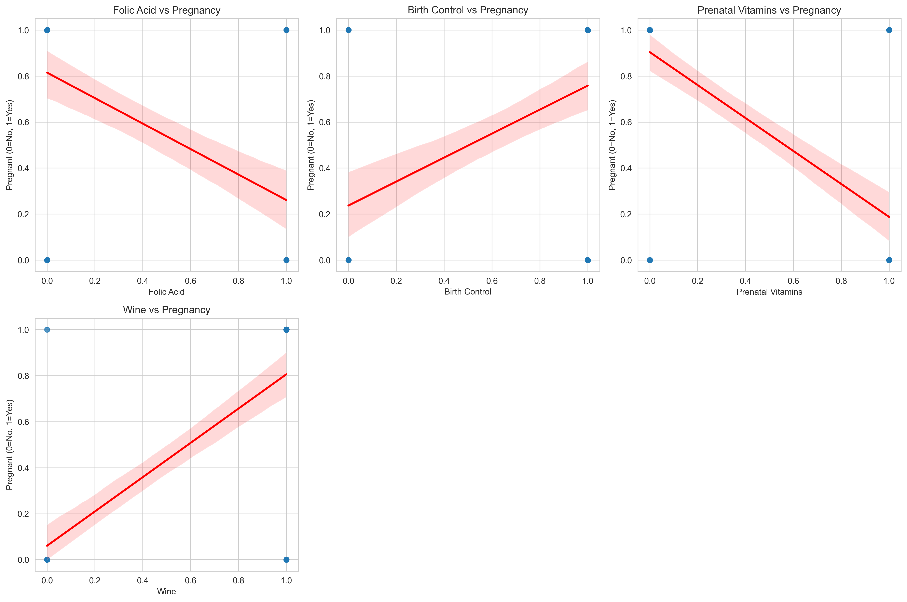

# Pregnancy Prediction Analysis

[](https://github.com/jfm56/regression_analysis/actions/workflows/production.yml)
[](https://codecov.io/gh/jfm56/regression_analysis)


This project analyzes purchasing behavior patterns to predict pregnancy status using logistic regression. The model achieves 84.5% accuracy in predicting pregnancy based on various shopping behaviors and lifestyle changes.

## Installation

1. Clone the repository:
```bash
git clone https://github.com/jfm56/regression_analysis.git
cd regression_analysis
```

2. Install required dependencies:
```bash
pip install -r requirements.txt
```

Required dependencies:
- pandas==2.1.0
- numpy==1.24.3
- scikit-learn==1.3.0
- openpyxl==3.1.2
- matplotlib==3.7.1
- seaborn==0.12.2

## Usage

1. Place your data file (Excel format) in the project directory
2. Run the analysis:
```bash
python regression.py
```

The script will generate three visualization files:
- `correlation_heatmap.png`: Shows correlations between features
- `scatter_plots.png`: Displays relationships between key features and pregnancy
- `feature_importance.png`: Shows the importance of each feature

## Analysis Results

### Model Performance
- Accuracy: 84.50%
- Precision (Pregnant): 92%
- Recall (Pregnant): 74%
- F1-Score (Pregnant): 82%

### Key Findings

#### Strongest Positive Indicators of Pregnancy:
1. Folic Acid (2.94)
2. Prenatal Vitamins (2.22)
3. Pregnancy Test (1.96)
4. Maternity Clothes (1.72)
5. Ginger Ale (1.41)

#### Strongest Negative Indicators:
1. Birth Control (-2.03)
2. Feminine Hygiene (-1.73)
3. Wine (-1.29)
4. Cigarettes (-1.25)

### Visualization Explanation

#### Scatter Plots


The scatter plots show the relationships between six key features and pregnancy status:
- X-axis: Feature value
- Y-axis: Pregnancy status (0 = Not Pregnant, 1 = Pregnant)
- Red trend lines indicate the direction and strength of relationships
- Upward trends suggest positive correlation with pregnancy
- Downward trends suggest negative correlation with pregnancy

Key observations:
- Folic Acid and Prenatal Vitamins show strong positive correlations
- Birth Control and Wine show strong negative correlations
- The spread of points indicates the reliability of each relationship

## Feature Importance
The model identifies purchasing patterns that are most predictive of pregnancy:
- Health supplements (Folic Acid, Prenatal Vitamins) are the strongest positive indicators
- Contraceptives and lifestyle products (Birth Control, Wine, Cigarettes) are strong negative indicators
- Changes in purchasing behavior (stopping wine/cigarettes) are moderately strong indicators

## Development Setup

### Local Development
1. Install development dependencies:
```bash
pip install -r requirements.txt
```

2. Run tests:
```bash
pytest
```

3. Check code quality:
```bash
pylint regression.py
```

4. Check test coverage:
```bash
pytest --cov=regression_analysis
```

### Docker Development

#### Using Pre-built Image
```bash
docker pull jmullen029/regression_analysis:latest
docker run jmullen029/regression_analysis:latest
```

#### Local Development with Docker
1. Build and run using Docker:
```bash
docker-compose up --build
```

2. Run tests in Docker:
```bash
docker-compose run regression pytest
```

The Docker image is automatically built and published to Docker Hub on every push to main branch.

## Notes
- The model uses logistic regression for binary classification (Pregnant/Not Pregnant)
- Features are encoded using Label Encoding for categorical variables
- The dataset is split 80/20 for training and testing
- Results include both positive and negative predictors for comprehensive analysis
- Includes comprehensive test suite with pytest
- Docker support for consistent development environment
- Code quality maintained with pylint
- Test coverage tracked with pytest-cov
